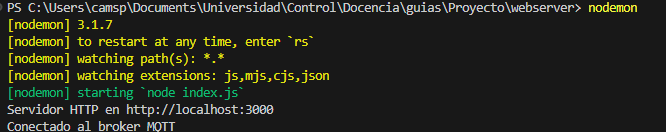
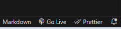

# Tutorial

## Broker
Para hacer uso de MQTT, es necesario usar un broker, este es un dispositivo intermediario en la comunicación que envía y recibe los mensajes, para ello puede realizarlo en su computador con Ubuntu, u otros dispositivos como una raspberry. Puede guiarse del siguiente tutorial, (Para windows o mac tendrá que buscar otro tutorial y prober por su cuenta):

[Brroker tutorial](https://www.youtube.com/watch?v=KOohvO4ngTw&ab_channel=ADTechKnow)


## Instalación (webserver)

Para ejecutar el servidor web necesitaran instalar node.js:

[Link de Node.JS](https://nodejs.org/es)

Tambien necesitarán la extención de vs code Live Server


Una vez instalado, abran una nueva terminal en la carpeta "./webserver" y ejecuten el comando:

```
npm i
```

Este comando instalará las librerías para el servidor web. En el archivo "index.js", ajuste la ip del broker:

```
// Broker IP
const client = mqtt.connect('mqtt://192.168.0.9');
``` 

Finalmente, ejecute el siguiente comando para inciar el web server:

```
nodemon
```

Si todo es correcto, debería salir el siguiente mensaje:



Luego, inicie la pagina web, para ello, abra el documento "index.html" y presione el boton "Go live" en la parte inferior derecha de VS code:



Esto abrirá una pagina web donde tendrán las graficas en tiempo real.


## Graficar variables

### ESP32

* Cree un buffer para la variable:

```
float kp = 0;
float kpBuffer[BUFFER_SIZE];
```

* Añada el valor actual de la variable el buffer en la tarea publishStateTask

```
kpBuffer[indexFrame] = kp;
```

* Añada la variable al JSON que envía el microprocesador, dentro de la función publishVars:

```
  doc["kp"] = arrayToString(kpBuffer, indexFrame + 1);
```

### Web server


* Dentro de la función client.on('message', ...), añada la variable y conviertala de hexadecimal a decimal, y filtrela para aproximar a 0 valores muy pequeños:

```
let kp = hexToDecimal(data.kp);
decimalKp = kp.map(filterSmallValues);
decimalKp.shift();
``` 

* Envíe la variable a traves de un JSON por el websocket:

```
ws.send(JSON.stringify({
    kp: decimalKp,
    ki: decimalKi,
    kd: decimalKd
}));
```

### Página web

* Cree un plot para la variable, Tenga en cuenta el id que le ponga al plot, en este caso, "Current Kp":

```
    <div class="chart-container">
        <h2>Kp</h2>
        <canvas id="Current Kp"></canvas>
    </div>
```

* Cree el plot, asegurese que el plot no exista, en este caso, chart1.
* Puede añadir varias variables al mismo plot, en este caso, ki:
  
```
const chart1 = createChart('Current Kp', [], [
{ label: 'Kp', data: [], borderColor: 'red', borderWidth: 1, fill: false, tension: 0.1, pointRadius: 0 },
{ label: 'Ki', data: [], borderColor: 'green', borderWidth: 1, fill: false, tension: 0.1, pointRadius: 0 }
], 'Tiempo (s)', 'Valor');
```

* Cree una variable para almacenar los datos de la variable

```
 let kp_values = [];
```

* Si es necesario, ajuste el tiempo de muestreo:
```
let timeStep = 0.005;
```

* Dentro de la función updateCharts(), actualice los valores del buffer y el plot:

```
if (kp_values.length > maxDataPoints) {
    kp_values.shift();
    ...
}
// Eliminar datos que superen el tiempo máximo
while (time_labels[0]< time - maxTime) {
    kp_values.shift();
    ...
}
chart1.data.labels.push(...Array.from({ length: bufferSize }, (_, i) => time + i * timeStep));
chart1.data.datasets[0].data.push(...kp_values.slice(-bufferSize));
chart1.update();
```

* Dentro de la función processData(), añada el valor recibido al conjunto de datos.
* message es el mensaje recibido en formato JSON, puede desestructurar el objeto por sus llaves:

```
const { kp, ki, kd } = message;
kp_values.push(...kp);
```

* En la función resetTime(), asegurese de reiniciar el conjunto de datos:

```
kp_values = [];
chart1.data.datasets[0].data = [];
chart1.update();
```

* Por ultimo, para descargarlo en formato CSV, añada la variable en la función downloadCSV():

```
let csvContent = "t,kp,ki,kd\n";
for (let i = 0; i < kp_values.length; i++) {
    csvContent += `${time_labels[i]},${kp_values[i]},${ki_values[i]},${kd_values[i]}\n`;
}
```

## Enviar variables

### Página web

* Cree un campo con el nombre de la variable, para el ejemplo usaremos kd:

```
<label for="kd">KD:</label>
<input type="number" id="kd" placeholder="KD" step="0.01">
```

* Dentro de la función sendData(), convierta la variable de string a float:

```
const kd = parseFloat(document.getElementById('kd').value) || 0;
```

* Añada la variable al objeto JSON, de la forma "kd":kd, es decir "nombreVariable":variable:

```
const pidData = { "kp": kp, "ki": ki, "kd":kd };
```

### Web server

* En la función app.post('/pid'...), extraiga el valor recibido desde la pagina web a traves del body de la solicitud:

```
const { kp, ki, kd } = req.body;
```

* Valide si los valores son numericos:

```
  if (typeof kp !== 'number' || typeof ki !== 'number' || typeof kd !== 'number') {
    return res.status(400).send({ error: 'Kp, Ki y Kd deben ser números.' });
  }
```

* Convierta los valores a hexadecimal y cree un objeto JSON:

```
  const message = JSON.stringify({
    kp: float2hex(kp),
    ki: float2hex(ki),
    kd: float2hex(kd),
  });
```

* Publique las variables por el tópico destinado a la comunicación, para este ejemplo "/seg/PID":
  
```
  // Publish values
  client.publish('/seg/PID', message, (err) => {
    if (err) {
      console.error('Error al publicar los parámetros PID:', err);
      return res.status(500).send({ error: 'Error al enviar los parámetros PID.' });
    }
    console.log('Parámetros PID enviados:', message);
    res.status(200).send({ message: 'Parámetros PID enviados correctamente.' });
  });
```


### ESP32
* SOLO SI ES NECESARIO, cree un tópico en el arcivo topics.h:

```
#define USER_SYS_PID                "/seg/PID"
```

* Si creó un nuevo tópico, suscribase a el en la función connectMqtt():
```
mqttClient.subscribe(USER_SYS_PID); 
```

* En la función mqttCallback(...), convierta el valor de hexadecimal a float:

```
kd = hex2Float((const char *) doc["kd"]);
```

